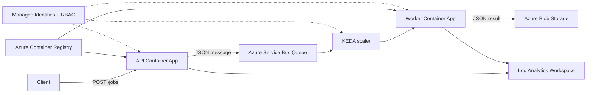

# Azure Container Apps Event-Driven Worker

A small event-driven Azure platform built with **Terraform**, **Azure Container Apps**, **Azure Service Bus**, **KEDA autoscaling**, **Managed Identity**, **Blob Storage**, and **GitHub Actions**.

The project demonstrates how to build and deploy an asynchronous API/worker architecture without storing application credentials in code.

## Architecture



### Request flow

1. A client sends a JSON request to `POST /jobs`.
2. The API publishes the JSON payload to the `jobs` Service Bus queue.
3. KEDA monitors the queue length.
4. The worker scales from **0 to 3 replicas** depending on queue depth.
5. A worker receives the message and writes the result to the private `results` Blob container.
6. The message is completed only after successful processing.
7. Failed messages are retried and can be moved to the Dead-letter Queue.

## Azure resources

| Resource | Purpose |
| --- | --- |
| Azure Container Apps | Runs the API and background worker |
| Container Apps Environment | Shared execution and logging boundary |
| Azure Container Registry | Stores API and worker container images |
| Azure Service Bus | Decouples API requests from worker processing |
| Azure Blob Storage | Stores processed JSON results |
| Managed Identity | Passwordless authentication between Azure services |
| Azure RBAC | Grants least-privilege access to ACR, Service Bus, and Blob Storage |
| Log Analytics Workspace | Collects Container Apps console and system logs |
| KEDA | Scales the worker based on Service Bus queue depth |

## Autoscaling

The worker uses a Service Bus KEDA scale rule.

```text
Queue empty
    -> 0 worker replicas

Messages arrive
    -> worker starts

~5 queued messages per replica
    -> scale out

Maximum
    -> 3 worker replicas

Queue drained
    -> scale back to 0
```

This was tested by sending multiple jobs and observing the worker scale from **0 to 2 replicas**, then return to **0** after processing completed.

## Authentication

The application does not use Service Bus or Storage connection strings.

User-assigned Managed Identities are used for:

- API -> ACR: `AcrPull`
- API -> Service Bus: `Azure Service Bus Data Sender`
- Worker -> ACR: `AcrPull`
- Worker -> Service Bus: `Azure Service Bus Data Receiver`
- Worker -> Blob Storage: `Storage Blob Data Contributor`
- KEDA -> Service Bus: worker Managed Identity

The Python applications use `DefaultAzureCredential` with the Managed Identity client ID supplied through the Container App environment.

## Message processing and failure handling

The worker receives messages in **Peek-Lock** mode.

```text
Processing succeeds
    -> upload result to Blob
    -> complete_message()
    -> message removed from queue

Processing fails
    -> abandon_message()
    -> message becomes available for retry

Repeated failures
    -> dead_letter_message()
    -> message moved to DLQ
```

The worker records a dead-letter reason and error description when explicitly moving a failed message to the DLQ.

## CI/CD

The repository separates **infrastructure lifecycle** from **application deployment**.

### Bootstrap environment

`.github/workflows/bootstrap-all.yml`

Used to rebuild the environment from scratch:

```text
Terraform init / validate
        |
Create ACR first
        |
Build API + Worker images on GitHub-hosted runner
        |
Push images to ACR
        |
Terraform apply remaining infrastructure
```

ACR is created first because Container Apps cannot successfully deploy until their referenced images exist.

### Application deployment

`.github/workflows/deploy-app.yml`

Used for normal application updates:

```text
Change app/ or worker/
        |
Build API and Worker images in parallel
        |
Push images tagged with Git commit SHA
        |
Update Container Apps
        |
Verify deployed image tags
```

Using the Git commit SHA as the image tag makes each deployment traceable to the source revision.

Terraform ignores changes to the Container App image field so that responsibilities stay separated:

- **Terraform** manages infrastructure configuration.
- **GitHub Actions** manages application image versions and deployment.

### Destroy environment

`.github/workflows/terraform-destroy.yml`

The destroy workflow requires an explicit confirmation input and uses a protected GitHub Environment before running `terraform destroy`.

## Repository structure

```text
.
├── app/
│   ├── app.py
│   ├── Dockerfile
│   └── requirements.txt
├── worker/
│   ├── worker.py
│   ├── Dockerfile
│   └── requirements.txt
├── terraform/
│   ├── main.tf
│   ├── azure-container-app.tf
│   ├── azure-container-worker.tf
│   ├── queue.tf
│   └── blob.tf
└── .github/
    └── workflows/
        ├── bootstrap-all.yml
        ├── deploy-app.yml
        └── terraform-destroy.yml
```

## GitHub Actions authentication

GitHub Actions authenticates to Azure using **OIDC**, avoiding a long-lived Azure client secret.

The following repository secrets are required:

```text
AZURE_CLIENT_ID
AZURE_TENANT_ID
AZURE_SUBSCRIPTION_ID
```

The Azure identity used by GitHub Actions must also have the permissions required to create the infrastructure and push images to ACR.

## Example request

After deployment, send a job to the API:

```powershell
Invoke-RestMethod `
  -Method Post `
  -Uri "https://<api-fqdn>/jobs" `
  -ContentType "application/json" `
  -Body '{"task":"hello"}'
```

Example Service Bus payload:

```json
{
  "task": "hello"
}
```

The processed result is stored in the private Blob Storage `results` container.

## What I focused on

This project was created as a hands-on exercise to understand the interaction between cloud infrastructure and application deployment, especially:

- Terraform resource dependencies and state
- Docker image build and registry workflows
- Infrastructure deployment versus application deployment
- Managed Identity and RBAC
- Asynchronous processing with Service Bus
- KEDA-based scale-to-zero and scale-out
- Retry and Dead-letter Queue handling
- Container logging with Log Analytics
- GitHub Actions OIDC authentication

## Possible future improvements

The current project intentionally stays small. Possible extensions include:

- Private networking and Private Endpoints
- Application Insights and alerting
- Stable job IDs and idempotent Blob writes
- Automated integration tests after deployment
- More granular Managed Identities for scaler and workload responsibilities
